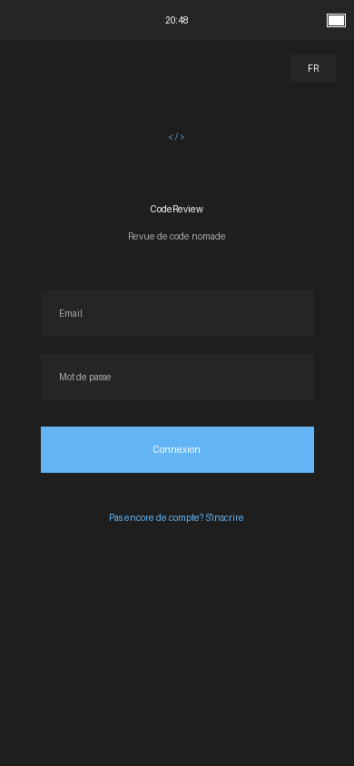
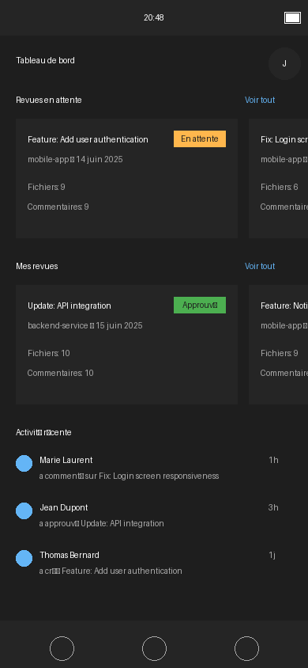
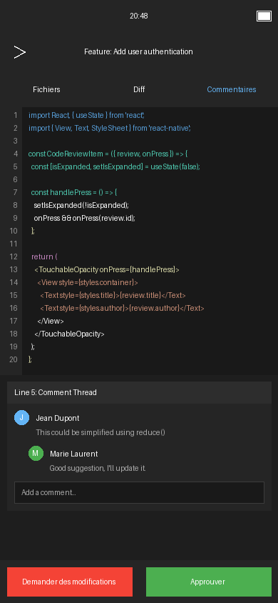
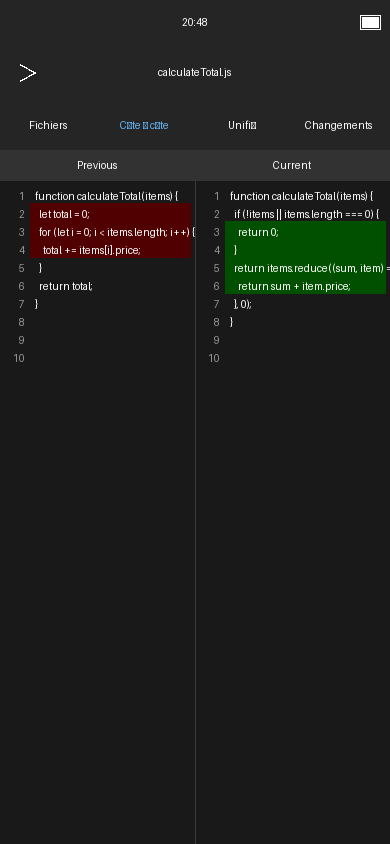
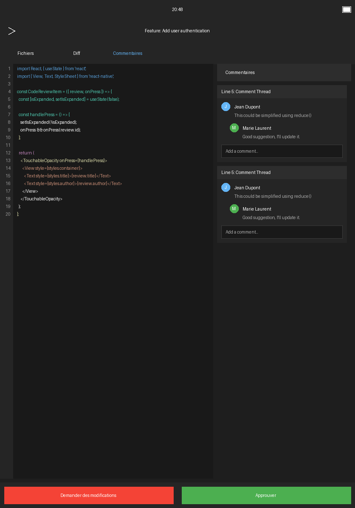
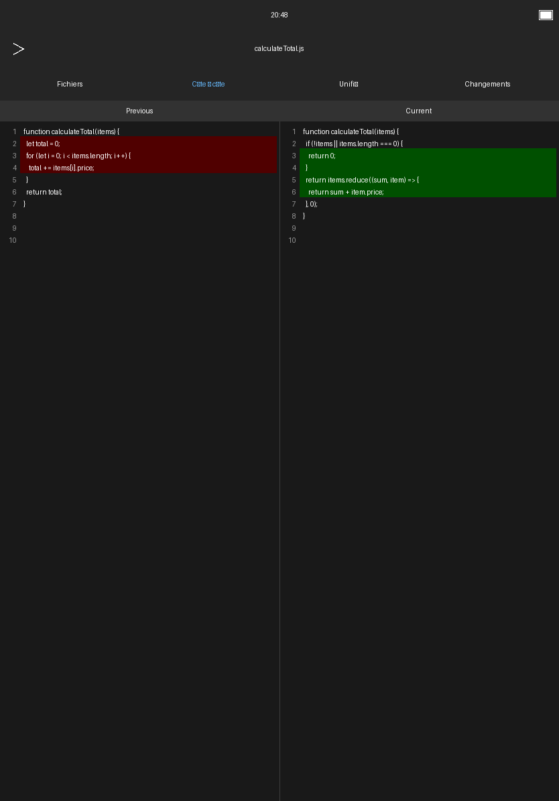

# CodeReview Mobile

## Application mobile de revue de code ergonomique

Cette application a été développée dans le cadre d'un mémoire de Master sur la conception d'un environnement de revue de code nomade ergonomique.


## Fonctionnalités principales

- **Visualisation de code** avec coloration syntaxique adaptée aux écrans mobiles
- **Visualisation des différences** (diff) entre versions de fichiers
- **Système de commentaires** contextuel lié à des lignes de code spécifiques
- **Explorateur de fichiers** pour naviguer facilement dans la structure d'un projet
- **Gestion des revues** avec suivi de l'état et assignation
- **Support hors ligne** pour travailler sans connexion internet
- **Interface ergonomique** optimisée pour les appareils mobiles
- **Support multilingue** (français et anglais)
- **Mode sombre** pour réduire la fatigue oculaire

## Captures d'écran

### Téléphone

<div style="display: flex; flex-wrap: wrap; gap: 10px;">
  
  
  
  
</div>

### Tablette

<div style="display: flex; flex-wrap: wrap; gap: 10px;">
  
  
</div>

## Installation

### Prérequis

- Node.js (v16 ou supérieur)
- npm ou yarn
- Expo CLI
- Android Studio (pour le développement Android)
- Xcode (pour le développement iOS, macOS uniquement)

### Installation des dépendances

```bash
# Cloner le dépôt
git clone https://github.com/username/code-review-mobile.git
cd code-review-mobile

# Installer les dépendances
npm install
# ou
yarn install
```

### Lancement de l'application

```bash
# Démarrer l'application avec Expo
npm start
# ou
yarn start
```

Suivez les instructions dans le terminal pour lancer l'application sur un émulateur ou un appareil physique.

## Architecture

L'application est construite avec React Native et suit une architecture modulaire basée sur les composants. Voici la structure principale du projet :

```
app/
├── src/
│   ├── components/       # Composants UI réutilisables
│   ├── screens/          # Écrans de l'application
│   ├── services/         # Services et logique métier
│   └── utils/            # Fonctions utilitaires
├── assets/               # Ressources (images, polices, etc.)
└── docs/                 # Documentation
```

### Composants principaux

- **CodeViewer** : Affichage du code avec coloration syntaxique
- **DiffViewer** : Visualisation des différences entre versions
- **CommentThread** : Gestion des fils de commentaires
- **FileExplorer** : Navigation dans la structure des fichiers
- **ReviewStatusIndicator** : Affichage de l'état des revues

### Services

- **ApiService** : Communication avec l'API backend
- **AuthService** : Gestion de l'authentification
- **StorageService** : Persistance des données et support hors ligne
- **ContextProviders** : Gestion de l'état global de l'application

## Considérations ergonomiques

L'application a été conçue avec une attention particulière à l'ergonomie sur appareils mobiles :

- **Adaptation aux écrans de petite taille** avec mise en page responsive
- **Interactions tactiles optimisées** avec zones de toucher généreuses
- **Navigation simplifiée** pour réduire le nombre d'interactions nécessaires
- **Mode hors ligne** pour travailler sans connexion internet
- **Optimisations de performance** pour une expérience fluide

## Fonctionnalités d'accessibilité

- **Support des lecteurs d'écran** avec étiquettes descriptives
- **Mode sombre** pour réduire la fatigue oculaire
- **Options de taille de texte** ajustables
- **Contraste suffisant** entre le texte et l'arrière-plan

## Technologies utilisées

- **React Native** : Framework de développement mobile
- **React Navigation** : Navigation entre les écrans
- **i18next** : Internationalisation
- **AsyncStorage** : Stockage local des données
- **react-syntax-highlighter** : Coloration syntaxique du code

## Licence

Ce projet est développé dans le cadre d'un mémoire universitaire et n'est pas disponible pour une utilisation commerciale sans autorisation.

## Auteur

[Nom de l'auteur] - Étudiant en Master à [Nom de l'université belge]

## Remerciements

- [Nom du directeur de mémoire] pour son encadrement et ses conseils
- [Nom de l'université] pour son soutien
- La communauté React Native pour les ressources et outils open source